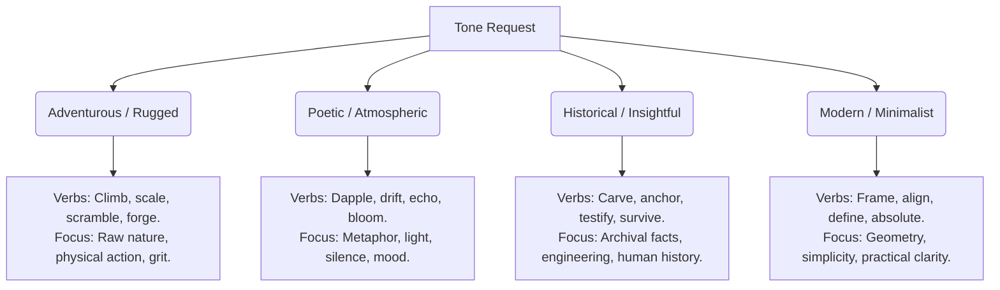

# Travel Copywriting & Tone Reference Guide

Use this guide to govern the voice, structure, and quality of travel copy. High-quality travel writing must establish an emotional, sensory connection with the traveler, moving beyond simple brochures or factual catalogs.

---

## 1. Copywriting Frameworks for Travel

### Framework: HSE (Hook - Story - Experience)
Use this framework as the default for primary place descriptions.

| Phase | Purpose | Tactical Execution |
|---|---|---|
| **Hook** | Grab immediate attention. | Use a dramatic statement, local sensory detail, or provocative historical oddity. Avoid "Welcome to...". |
| **Story** | Establish historical or cultural weight. | Share a single, powerful narrative beat (e.g., *why* a stone was laid, the human struggle behind a castle, or a local legend). |
| **Experience** | Ground the reader in the present moment. | Describe the sights, smells, sounds, and physical sensations of standing in this spot *right now*. |

---

## 2. Banned Words & Clichés Blocklist

Aesthetically premium copy must never contain lazy marketing clichés. Use the following table to audit drafts and replace generic words with sensory-specific alternatives.

| ❌ Banned Cliché | ⚠️ Why it Fails |  Evocative Alternatives |
|---|---|---|
| **"Hidden gem"** | Completely overused and empty. | "Secluded courtyard," "tucked behind a non-descript stone arch," "forgotten sanctuary." |
| **"Nestled in the heart of..."** | Lazy geographical placement. | "Perched along the craggy ridgeline," "cradled by olive groves," "anchored at the base." |
| **"Stone's throw away"** | Inprecise and highly colloquial. | "A three-minute stroll along paved pathways," "just across the gravel lane." |
| **"Something for everyone"** | Indicates lack of focus or target. | Specify exactly *who* it is for and *why* (e.g., "quiet retreats for solo contemplation, alongside shaded meadows where children can run"). |
| **"Breathtaking views"** | Vague. Doesn't paint a picture. | "Panoramic vistas of red clay roofs," "the blue horizon melting into the grey cliffs." |
| **"Step back in time"** | Melodramatic cliché. | "The moss-covered Roman bricks reveal layers of centuries-old mortar," "original iron hinges remain." |
| **"Stunning / Beautiful / Picturesque"** | Tells instead of showing. | Describe the color, light, geometry, or material (e.g., "weathered terracotta," "dappled morning sunlight filtering through oak leaves"). |
| **"Melt-in-your-mouth"** | Overused culinary cliché. | "Buttery and velvet-smooth texture," "flaky crust that fractures at the touch," "bold citrus notes." |

---

## 3. Tone Profiles Matrix

Tailor the copy's voice based on the group's profile and requested tone.

### Tone Specifications:
1. **Adventurous / Rugged**: High-energy, visceral. Focus on the raw physical environment (mud, wind, altitude) and the thrill of discovery.
2. **Poetic / Atmospheric**: Slower-paced, descriptive. Uses rich metaphors, focusing on silence, shifting shadows, and the weight of history.
3. **Historical / Insightful**: Intelligent, authoritative. Explains *why* things are the way they are, using architectural terms and localized anecdotes.
4. **Modern / Minimalist**: Clean, functional. Short sentences, bullet points for key facts, highly design-focused.

---

## 4. Copywriting Makeovers (Before vs. After)

### Case Study 1: Historical Landmark (Pisa Leaning Tower)
* **❌ BAD (Generic Travel Agent)**: 
  > *"Welcome to the Leaning Tower of Pisa! Nestled in the heart of beautiful Tuscany, this stunning hidden gem has been drawing tourists for ages. It's a must-visit spot with breathtaking views from the top. Truly something for everyone!"*
* **🏆 PREMIUM (HSE Framework - Historical/Insightful)**:
  > *"A monument defined by its own architectural failure, the marble campanile of Pisa tilts at a physics-defying angle over the green turf of the Piazza dei Miracoli. Begun in 1173 on shifting, sandy subsoil, the tower became an accidental masterpiece. Standing at its base, the sheer, vertical mass of pale marble seems to lean over you like a giant frozen in mid-collapse. The air smells faintly of sweet clover and warm stone, while the soft chime of the ancient cathedral bells echoes off the surrounding Romanesque columns."*

### Case Study 2: Hiking Route (Skaftafell Glacier)
* **❌ BAD (Generic Travel Agent)**:
  > *"Come experience the gorgeous Skaftafell glacier! It's a picturesqe hike that is a stone's throw from the parking lot. You can step back in time and relax in the beautiful nature. Make sure you don't miss this hidden gem!"*
* **🏆 PREMIUM (HSE Framework - Adventurous/Rugged)**:
  > *"The black basalt dust gives way to massive tongues of blue ice as you step onto the frozen expanse of Skaftafelljökull. Squeezed between towering dark volcanic ridges, the glacier groans and cracks under its own immense weight. The cold wind blowing off the icecap bites your cheeks, carrying the metallic scent of crushed mineral dust. Walking here requires active footwork, feeling the crampon spikes bite into the hard, textured ice, while deep, sapphire-blue crevasses plunge into darkness just feet from the marked trail."*
